<!DOCTYPE html>

<html lang="ko">
<head>
    <meta charset="UTF-8">
    <meta name="viewport" content="width=device-width, initial-scale=1.0">
    <title>Portfolio</title>
    <link rel="stylesheet" href="../css/styles.css">
</head>
<body>

## Publications <!-- {docsify-ignore} -->
#### Papers <!-- {docsify-ignore} -->

    2024 <!-- 연도 추가 -->
    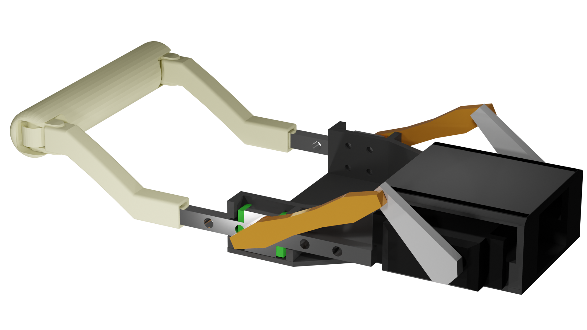
    

        Guide Dog AR: A Tactile and Auditory Assisting Device Design with the Motif of a Guide Dog for the Visually Impaired
        Soo Min Shin, <strong>Jongyoon Lim</strong>, Yongsoon Choi 
        International Journal of Human–Computer Interaction, 1-14 
        이 연구는 “Guide Dog AR”을 소개합니다. 이 AR 장치는 안내견의 하네스 손잡이에서 영감을 받았습니다. 이 장치와 그에 관련된 콘텐츠는 시각 장애인에게 안내견과 함께 걷는 경험을 제공하며, 실용적인 도구이자 오락의 기초 역할을 합니다. 이 장치는 촉각과 청각 감각을 통해 증강된 걷기 경험을 제공합니다. 이 장치는 "효과성"과 "몰입성"의 요소로 평가되었습니다. 효과성 평가를 위해 시뮬레이션된 가상 경로를 생성하였습니다. 몰입 수준은 사용자가 장치가 제공하는 증강 콘텐츠에 얼마나 깊이 몰입했는지를 기준으로 평가되었습니다. 성공률은 사용자가 장치의 피드백을 이용하여 이 가상 경로를 얼마나 잘 탐색했는지에 따라 결정되었습니다. 몰입도를 평가하기 위해, 시각 장애인 참가자들을 대상으로 심층 인터뷰를 진행하였고, 이들은 Guide Dog AR 장치를 사용하여 가상 경로를 경험한 후의 존재감, 촉각 및 청각 피드백과의 상호작용, 그리고 실제 안내견과의 내비게이션 경험과의 유사성에 대해 이야기했습니다. 결과적으로 참가자들은 이 장치가 가상 경로 탐색에 효과적이며, 실감나는 경험을 제공하여 작업 중 자신감과 즐거움을 높여준다고 응답했습니다. 이 연구는 Guide Dog AR이 시각 장애인을 위한 보조 기술과 매력적인 오락 플랫폼으로서의 가능성을 지니고 있음을 결론지었습니다. <a href="javascript:void(0);" onclick="toggleText(this)">View Details</a>
    

    2022 <!-- 연도 추가 -->
    
    

        HapTug: Force-Feedback Haptic Device for Representation of Tugs in Virtual Reality
        <strong>Jongyoon Lim</strong>, Yongsoon Choi 
        Electronics 11 (11), 1730 
        이 연구에서는 가상 현실(VR)을 위한 촉각 장치를 제안합니다. 제안된 촉각 장치는 VR 장치의 번들 컨트롤러와 연결됩니다. 본 연구에서 제안된 장치는 도구가 물체와 충돌하는 느낌보다 손에서 느껴지는 촉각에 중점을 둔 힘 피드백 장치입니다. 사용자가 도구를 흔들 때 도구의 무게로 인해 원심력 또는 관성력을 느끼게 하며, 도구로 물체를 찌르거나 찌를 때 반응력을 느끼게 합니다. 연결형 촉각 장치에서 생성된 힘은 가상 환경에서 도구를 실제로 사용하는 느낌을 제공하는지를 판단하기 위해 측정하고 검토하였습니다. 또한, 두 가지 실험을 실시하여 이 촉각을 평가했습니다. 첫 번째로, 사용자 경험을 위해 VR 콘텐츠를 제작하고, 30명의 실험자를 대상으로 번들 컨트롤러와 HapTug이라고 불리는 촉각 장치를 현실감, 몰입감, 즐거움 측면에서 비교하는 설문조사를 실시했습니다. 설문조사 결과, 번들 컨트롤러를 단독으로 사용하는 것보다 현실감, 몰입감, 즐거움이 증가한 것으로 나타났습니다. 두 번째로, 41명의 실험자가 가상 환경에서 자유롭게 플레이하도록 하여 30초씩 6회 세션을 진행했습니다. 그들은 버튼을 눌러 30초를 제어해야 했고, 착용한 장치는 매 세션마다 무작위로 켜졌다 꺼졌다 했습니다. 경험 중 그들의 재생 시간, 상호작용 수, 범위를 측정하였습니다. 결과적으로 장치가 활성화되었을 때 실험자들은 시간이 짧다고 느꼈고 폭넓은 움직임을 보였습니다. 따라서 제안된 연결형 촉각 장치가 도구를 휘두르는 느낌을 효과적으로 전달하고, 사용자가 가상 객체와 상호작용할 때 손에 들어오고 나가는 느낌을 전달하는 것이 입증되었습니다. 또한 실험을 통해 세 가지 가능성이 발견되었습니다. 이전 VR 경험 시간은 촉각 사용의 만족도와 거의 관련이 없으며, 사용자는 촉각 현실감에 대한 기대치가 낮고, 사용자는 촉각 장치와 더 적극적으로 상호작용하는 것으로 나타났습니다. <a href="javascript:void(0);" onclick="toggleText(this)">View Details</a>
    

    2021 <!-- 연도 추가 -->
    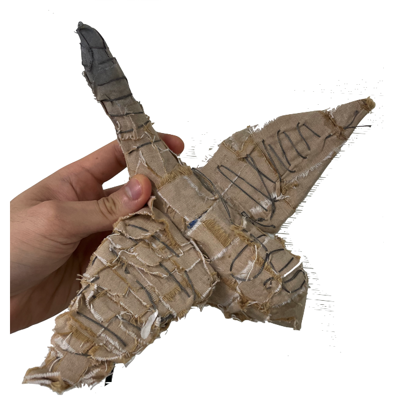
    

        BirdVR: UX design that enhances the connection between the form of the VR controller and the interaction within the content
        Kyoungmin Bang, <strong>Jongyoon Lim</strong>, Haree Jun, Hangyeol Jo, Jean Ho Chu 
        HCIK(HCI Korea)(2022): 813-815 
        BirdVR 프로젝트는 65세 이상의 노인을 위해 특별히 설계된 조류 모양의 VR 컨트롤러 개발을 목표로 하는 UI/UX 디자인 이니셔티브입니다. 이 프로젝트는 노인이 전통적인 VR 컨트롤러에서 경험하는 어려움과 복잡한 상호작용 기능으로 인한 몰입의 방해라는 두 가지 주요 문제를 해결합니다. BirdVR 컨트롤러는 조류 모양을 채택하여 혁신적인 솔루션을 제공합니다. 이는 VR 환경과의 일치를 통해 학습 과정을 단순화하고, 새 모양의 장치를 쓰다듬는 편안한 경험을 통해 심리적 안정성을 높입니다. 이 컨트롤러는 직관적이고 단순한 상호작용을 가능하게 하는 전도성 실을 이용한 인터랙티브 터치 영역을 갖추고 있습니다. 사용자 피드백에 따라 원래 디자인에 통합된 모터가 장착된 날개는 경험의 단순성과 편안함을 유지하기 위해 제거되었습니다. BirdVR 컨트롤러는 현재 서울 고강동의 복지센터에 구현되어 있으며, 노인을 위한 심리 치료 VR 콘텐츠에서 사용되고 있습니다. 이 프로젝트는 HCI Korea 2022에서 Creative Award 쇼케이스의 일환으로 Interactive Art Gallery에 전시되었습니다. <a href="javascript:void(0);" onclick="toggleText(this)">View Details</a>
    

 

## Projects <!-- {docsify-ignore} -->

#### Tangible Products <!-- {docsify-ignore} -->

    2024 <!-- 연도 추가 -->
    
    

        EverPen 2.0
        Exhibited at CES 2024, 2025, Korean Government Minister’s Award 
        Concept Design, Circuit Design, Hardware/Software Development, Sales 
        EverPen 2.0은 마우스가 데스크탑 컴퓨팅을 변화시킨 것처럼, 공간 컴퓨팅 분야에서 혁신을 가져올 것으로 기대됩니다. 전통적인 VR 컨트롤러의 한계를 넘어, EverPen 2.0은 독립적으로 작동하며, 외부 스테이션 없이 3D 좌표계에서 자신의 위치를 정확하게 추적합니다. 고급 손 추적 기술과 통합된 터치 및 물리적 센서를 결합하여 EverPen 2.0은 가상 환경에서 비할 데 없는 정밀도와 자유를 제공합니다. 차세대 HID로서 EverPen 2.0은 우리가 가상 현실과 상호작용하는 방식을 재정의하여 공간 컴퓨팅을 더욱 직관적이고 효율적이며 몰입감 넘치는 경험으로 만들 것입니다. <a href="javascript:void(0);" onclick="toggleText(this)">More</a>
    

    2023 <!-- 연도 추가 -->
    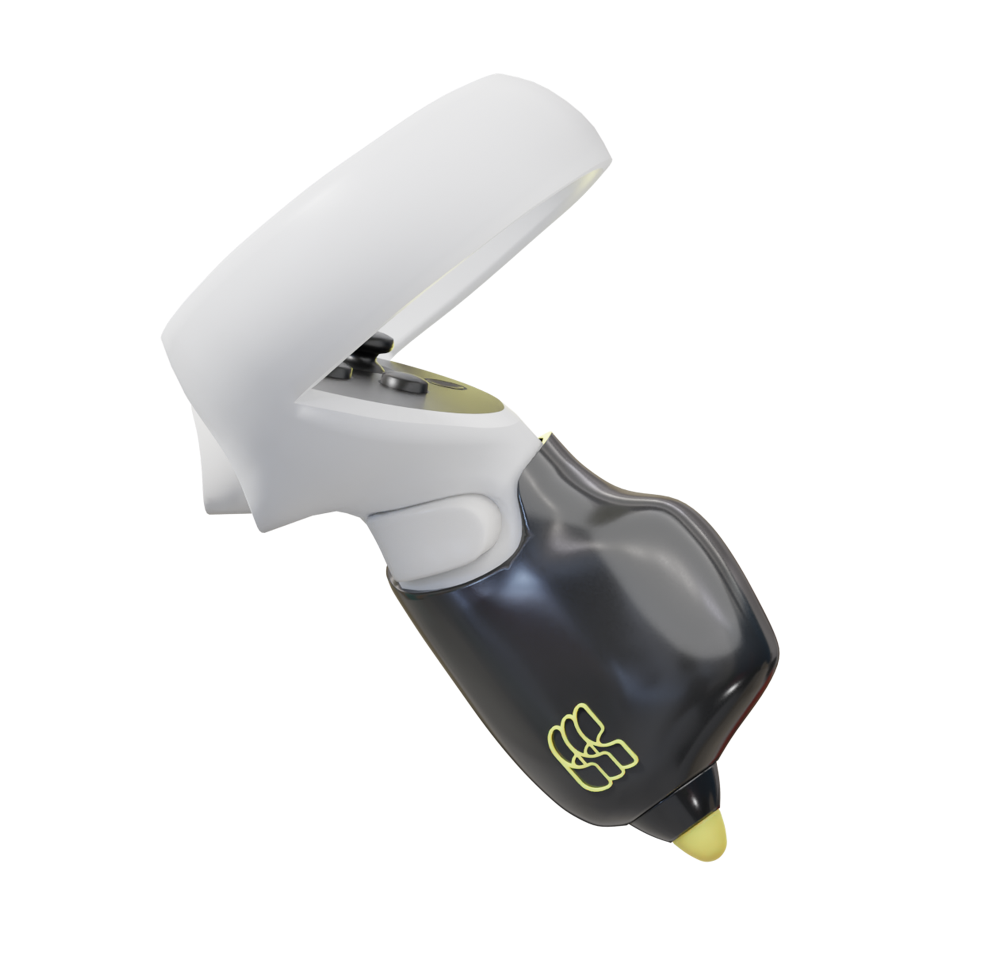
    

        EverPen 1.0
        Government Investment Secured, Exhibited at Korea Electronics Show 2023 
        Circuit Design, Hardware/Software Development 
        EverPen 1.0은 가상 현실 내 입력 경험을 향상시키기 위해 설계된 VR 액세서리입니다. VR 컨트롤러와 결합하여 기존 VR 컨트롤러의 촬영 버튼에 비해 더 자연스럽고 직관적인 방식으로 가상 환경과 상호작용할 수 있습니다. 이전에 VR 펜이 이 문제를 해결하기 위해 개발되었으나, 종종 특정 공간에 제한되거나 기존 VR 컨트롤러와의 호환성이 부족한 한계가 있었습니다. 반면 EverPen 1.0은 VR 컨트롤러와 원활하게 통합되어 사용자가 가상 현실에서 글을 쓰거나 그릴 수 있도록 하며, 정보를 헤드 마운트 디스플레이(HMD)에 무선으로 전송하고 표시합니다. 이 혁신적인 솔루션은 이전에 제한된 공간 세팅에서 요구되었던 별도의 위치 카메라 시스템의 필요성을 없앱니다. EverPen으로 사용자는 친숙한 펜 형태의 입력 제스처를 활용하여 더 몰입감 있고 유동적인 VR 상호작용 경험을 즐길 수 있습니다. <a href="javascript:void(0);" onclick="toggleText(this)">More</a>
    

    2022 <!-- 연도 추가 -->
    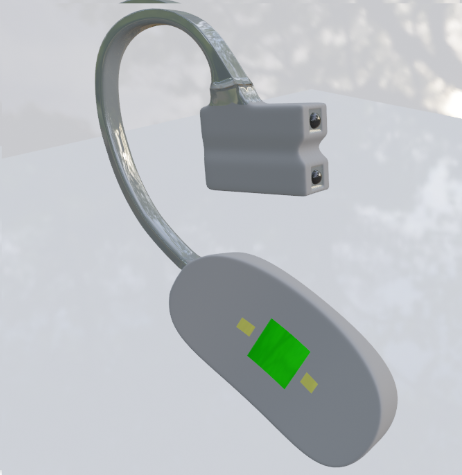
    

        Idealavor: Multi-Modality Eating Texture Haptic Device
        Electronics and Telecommunications Research Institute 
        Concept Design & Industrial Design 
        Idealavor 프로젝트는 식품 산업에서 음식 질감을 재현하는 방법을 탐구하며, 먹는 질감이 포만감과 맛 인식에 미치는 영향을 중점적으로 다룹니다. 고급 재료의 질감을 저렴한 대체품으로 복제하려는 전통적인 시도는 가격과 질감 차이로 인해 종종 실패하였습니다. 이 프로젝트는 시각, 청각 및 촉각 피드백을 결합한 다중 모달리티 접근 방식을 활용하여 음식 질감 인식을 향상시키는 방법을 제시합니다. 이 장치는 개별 씹는 패턴에 맞춘 질감 학습, 색상을 이용한 시각적 증강, 씹는 소리의 청각적 향상, 그리고 턱 근육에서 씹는 느낌을 직접 시뮬레이션하기 위한 EMS(전기 근육 자극)를 포함합니다. <a href="javascript:void(0);" onclick="toggleText(this)">More</a>
    

    2021 <!-- 연도 추가 -->
    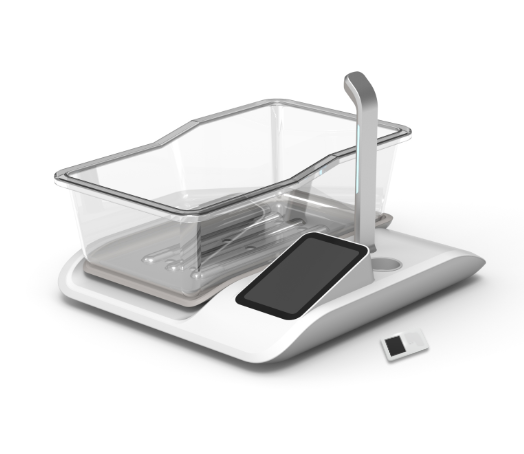
    

        Smart Cradle
        AI-driven Health Monitoring for Newborns 
        Concept Design, Industrial Design, Circuit Design, Hardware/Software Development, Sales 
        Smart Cradle은 갑작스러운 유아 사망을 예방하기 위해 설계되었습니다. 성인용으로 널리 사용되는 웨어러블 헬스케어 장치가 있는 반면, 신생아의 건강을 모니터링하는 장치는 현저히 부족하며, 이는 매우 중요한 문제입니다. Smart Cradle과 Smart Patch는 얼굴 표정, 체중, 공기 질, 산소 포화도(SpO2), 산소 수준 및 맥박과 같은 주요 건강 지표를 모니터링하기 위해 고급 AI 기반 알고리즘을 활용하여 이러한 간극을 메웁니다. 이 종합 모니터링 시스템은 영양 요구 사항, 배변 및 전반적인 건강 상태를 예측할 수 있도록 하여 신생아의 건강을 안전하게 지키기 위한 필수 도구가 됩니다. 
        <a href="javascript:void(0);" onclick="toggleText(this)">More</a>
    

    2017 <!-- 연도 추가 -->
    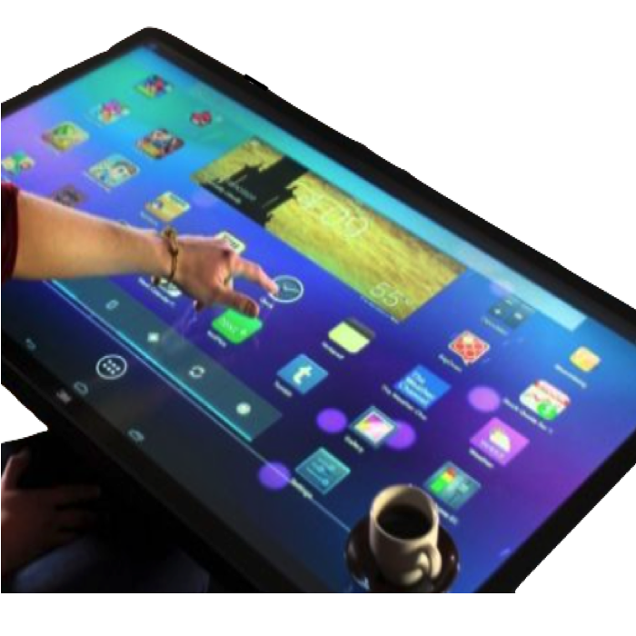
    

        Table-It: Motion and Color Recognition AR Table
        Korean Government Minister’s Award, Efesta2017 (KOREA) 
        Concept Design, Software Development 
        비전 인식과 프로젝터를 사용한 스마트 테이블은 2017 EFESTA에서 장관상을 수상하였습니다. 다양한 콘텐츠를 즐길 수 있는 스마트 테이블이 만들어졌습니다. Python을 사용하여 손 움직임 인식에 의해 마우스 커서가 구현되었으며, 손을 접었다 폈다 하여 클릭이 가능하였습니다. 따라서 사용자는 일반적으로 컴퓨터에서 사용하는 모든 프로그램을 운영할 수 있습니다. 또한 색상 인식을 통해 일반 태블릿에서는 즐길 수 없는 탁구 및 당구와 같은 전용 애플리케이션이 개발되었습니다. <a href="javascript:void(0);" onclick="toggleText(this)">More</a>
    

#### Arts and Games <!-- {docsify-ignore} -->

    2024 <!-- 연도 추가 -->
    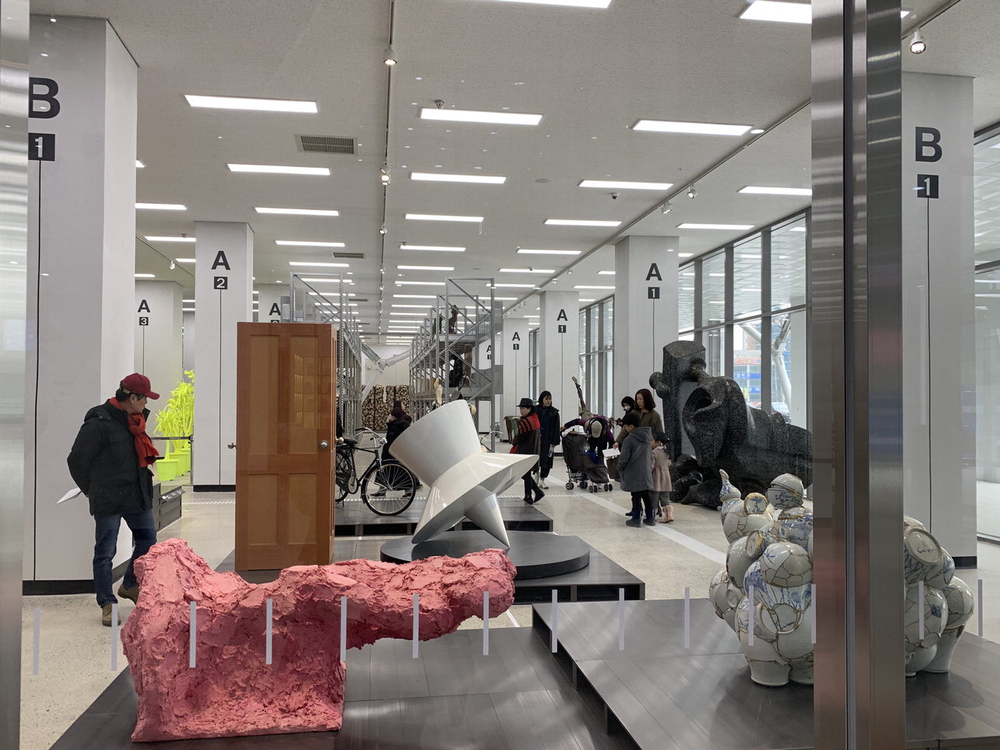
    

        MMCA Storage Chat Mobile
        IOS App, National Museum of Modern and Contemporary Art (MMCA) 
        Concept Design, UX/UI Design & Software Development 
        Storage Chat은 개인화된 대화형 AI 도슨트로, 생성 AI를 통해 개발된 모바일 앱입니다. 전통적인 검색 기능을 넘어, 방문객이 촬영한 박물관 전시물의 위치나 사진을 기반으로 실시간으로 상호작용하는 설명을 제공합니다. 제한된 정보만 제공하는 기존 도슨트와는 달리, 이 AI 도슨트는 예술 작품에 대한 추가적인 맥락, 추론 및 통찰력을 전달할 수 있어 보다 포괄적인 안내 역할을 합니다. <a href="javascript:void(0);" onclick="toggleText(this)">More</a>
    

    2024 <!-- 연도 추가 -->
    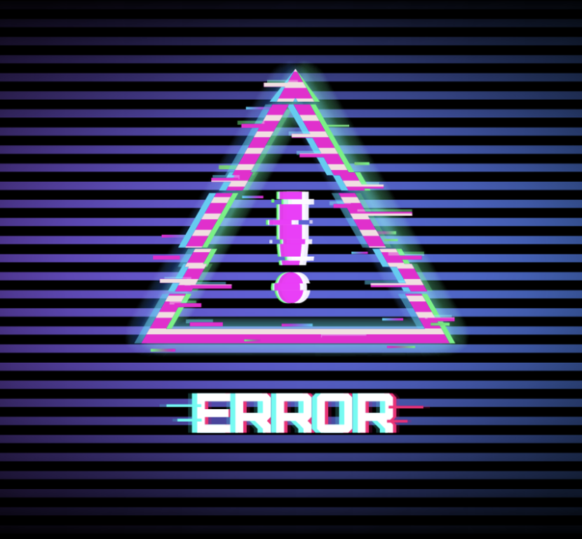
    

        BearHands
        Game
        3D Modeling, UX/UI Design & Software Development 
        BearHands는 Oculus Quest 3의 패스스루 기능을 완전히 활용한 VR 게임입니다. 이 게임은 플레이어가 낮과 밤, 현재와 과거를 넘나들며 주인공의 미스터리를 밝혀 나가는 경험을 제공합니다. 이 여정 동안, 플레이어는 퍼즐 해결과 FPS 요소가 독특하게 혼합된 경험을 하게 됩니다. 제목에서 알 수 있듯이, 플레이어는 컨트롤러를 사용할 수 있지만, 게임은 손 추적과 패스스루를 강조하여 현실과 가상 세계의 경계를 허물며 몰입감 있는 경험을 제공합니다. <a href="javascript:void(0);" onclick="toggleText(this)">More</a>
    

    2023 <!-- 연도 추가 -->
    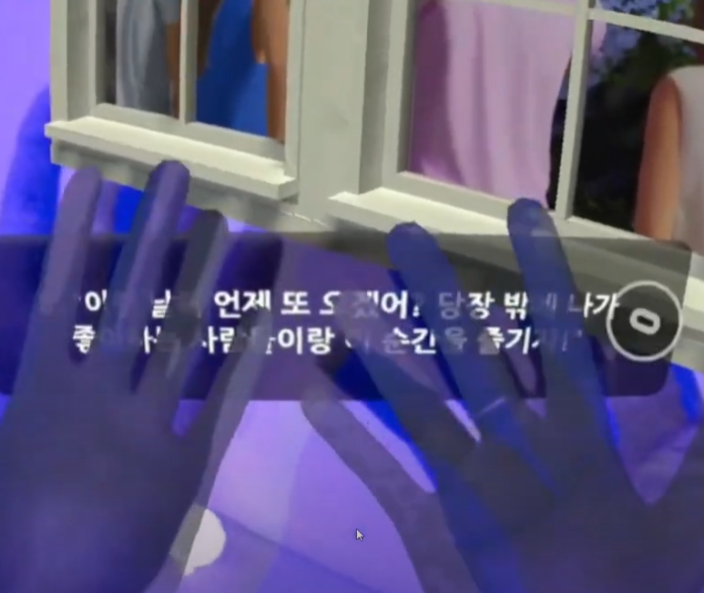
    

        Stern: Immersive Urban AR Experience
        Exhibition
        Stern은 방문객이 별빛이 비치는 도시 경관을 거닐며, 헤드 마운트 장치에 표시된 AR 비주얼과 현실 세계의 상호작용 전자 요소가 매끄럽게 융합되는 몰입형 전시입니다. 관람객은 경험을 진행하면서 다양한 질문을 접하고, 각 단계마다 개인 데이터 프로필을 풍부하게 합니다. 궁극적으로 전시의 마지막 단계에서 도시 스카이라인이 보이는 경치 좋은 전망대에 도달하여, 자신만의 성격과 선호에 대한 통찰을 제공하는 개인화된 분석을 받게 됩니다. <a href="javascript:void(0);" onclick="toggleText(this)">More</a>
    

    2023 <!-- 연도 추가 -->
    
    

        Starbound Odyssey
        VR Game
      Concept Design, Texturing, Shading & Software Development 
        "Starbound Odyssey"는 플레이어를 우주 유영의 경험에 몰입시키는 VR 게임으로, 만화 스타일의 음영 및 질감에 중점을 두고 있습니다. 이 게임은 우주의 물리적 현실과 대조되는 생동감 넘치는 만화 같은 미적 스타일을 특징으로 하여 독특한 시각적 스타일을 만들어냅니다. 플레이어는 아름답게 질감이 입혀진 우주 환경을 탐험하며 별들 사이를 떠다니고 천체 물체와 상호작용하며, 모두가 풍부하게 세밀하고 스타일화된 우주 내에서 이루어집니다. <a href="javascript:void(0);" onclick="toggleText(this)">More</a>
    

    2022 <!-- 연도 추가 -->
    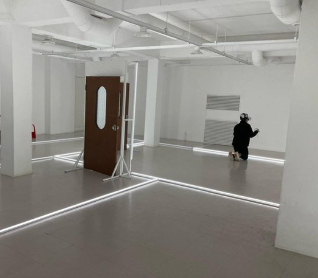
    

        Hotel Meta
        Exhibition
        Hardware Development 
        이 전시는 디지털 트윈으로, VR을 통해 현실 세계와 가상 세계에서 동시에 작동합니다. 물리적 공간을 실시간으로 반영하며, NFT 링크를 구매한 방문자는 주요 전시 외의 추가 상호작용에 접근할 수 있습니다. 관객은 메타버스를 통해 예술가의 무의식을 경험하며, 호텔은 예술가의 내면 세계와 관객 간의 공감의 공간을 상징합니다. 이 전시는 가상 환경과 현실 환경을 통합하여 예술이 관객과 소통하고 참여할 수 있는 새로운 방법을 탐구합니다. <a href="javascript:void(0);" onclick="toggleText(this)">More</a>
    

    2021 <!-- 연도 추가 -->
    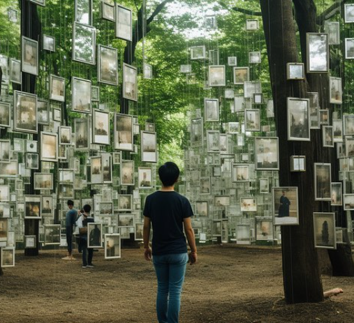
    

        AR Where Visitors' Footsteps Become The Artwork
        Exhibition, National Museum of Korea Project (2020) 
        Concept Design, UX/UI Design & Software Development 
        이 프로젝트는 BLE(블루투스 저전력) 기술을 활용하여 박물관과 전시관 내에서 혁신적인 AR 플랫폼을 만듭니다. 정밀한 내부 위치 지정을 구현함으로써, 이 플랫폼은 방문객의 움직임 및 상호작용 데이터를 기반으로 동적으로 AR 콘텐츠를 생성하여 방문객 경험을 향상시킵니다. AR 설치물은 발자국 빈도에 적응하여, 각 방문객의 경로에 따라 성장하고 변화하는 살아있는 예술 작품을 만들어냅니다. 이 시스템은 또한 전시와 관련된 인스타그램 사진을 표시하여 소셜 미디어 상호작용을 통합함으로써, 사용자 생성 콘텐츠로 물리적 공간을 풍부하게 하는 독특한 디지털 방명록을 생성합니다. <a href="javascript:void(0);" onclick="toggleText(this)">More</a>
    

    2020 <!-- 연도 추가 -->
    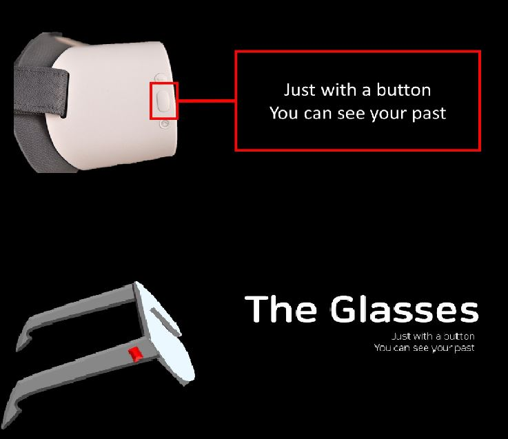
    

        Eliminate the Sense of Heterogeneity of VR Devices by Wearing Goggles in a Virtual Environment
        VR Movie, KT Super VR Contest (2020) 
        Concept Design & Software Development 
        이 영화는 관객이 현실 세계에서 수행하는 신체 제스처를 통해 가상 환경에서 이야기에 상호작용하는 몰입형 VR 영화입니다. 이 영화는 두 연인의 관계를 중심으로 전개되며, 사용자가 가상 선글라스를 착용하고 벗음으로써 과거와 현재 장면을 전환합니다. 이러한 상호작용은 관객이 수동적으로 영화를 감상하는 것이 아니라, 내러티브에 적극적으로 참여할 수 있도록 합니다. VR 내에서 실제 세계의 행동을 시뮬레이션함으로써, 이 영화는 감정적 몰입을 향상시키고 이야기의 깊이를 더합니다. 이 독특한 경험은 이 영화의 스토리텔링을 더욱 매력적으로 만듭니다. <a href="javascript:void(0);" onclick="toggleText(this)">More</a>
    

 

## CV <!-- {docsify-ignore} -->

<button class="styled-button" onclick="window.open('../CV.pdf', '_blank')">
     View PDF
</button>
  

## Others <!-- {docsify-ignore} -->
#### Hobbies

        
<strong>서핑:</strong> 나는 여름과 바다를 깊이 사랑하여 자연스럽게 서핑을 시작하게 되었습니다. 물속에 나가면 자연의 힘을 느끼고, 파도 위에 떠 있는 것은 특별히 짜릿한 경험입니다. 아직 기술을 연마 중이지만, 파도를 잡는 그 드문 순간은 마치 물 위를 걷는 듯한 마법 같은 느낌을 줍니다. 해변에 있을 때는 일상에서의 걱정이 사라지는 것 같습니다. 아마도 태양의 따뜻함 때문일까요, 해변에 있는 사람들은 항상 특별히 친절하고 열린 마음을 가지고 있습니다. 바다를 사랑하는 사람들 사이에는 특별한 동지애가 있습니다.
 <a href="javascript:void(0);" onclick="toggleExplainText(this)" class="more-btn">More</a>
        
        

            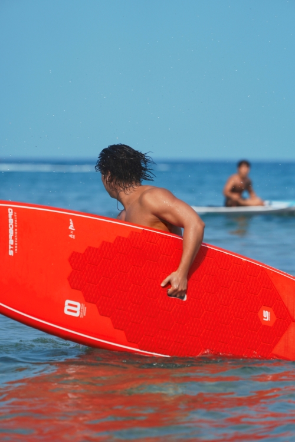
            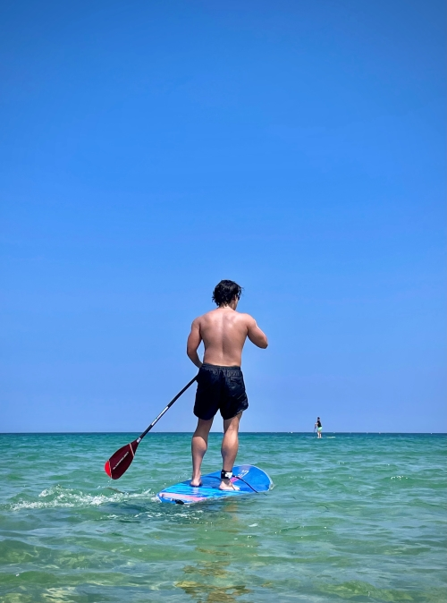
            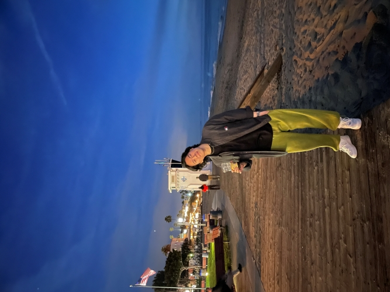
            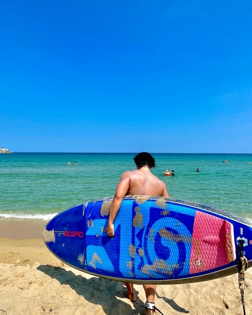
            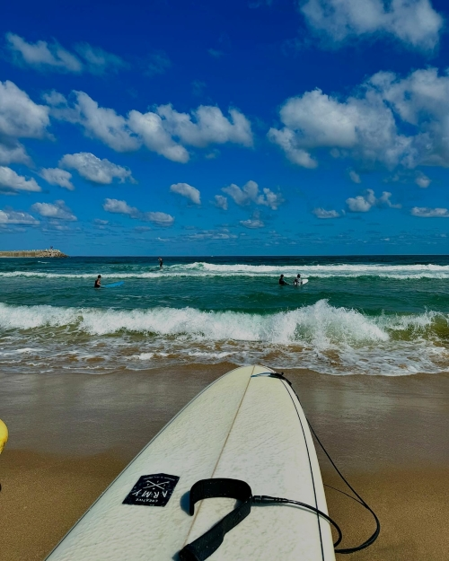
            
        

         
    

    
    

    
<strong>피트니스:</strong> 웨이트 트레이닝은 내 몸을 조각하는 데 도움을 줄 뿐만 아니라, 나에게 명상의 한 형태로 작용합니다. 나의 신체적 움직임에 온전히 집중하는 행동은 평온함을 가져다주며, 나의 마음을 비우고 중심을 잡는 데 도움을 줍니다. 전통적인 명상과 마찬가지로, 그 본질은 마음을 비우는 것이며, 웨이트 트레이닝 중에 나는 그 정신적 명료함의 상태를 달성할 수 있습니다. 나에게 이는 스트레스를 해소하고 균형을 회복하는 중요한 부분입니다. 또한, 더 나은 나 자신이 되기 위한 지속적인 여정의 필수적인 요소입니다.
<a href="javascript:void(0);" onclick="toggleExplainText(this)" class="more-btn">More</a>
        

            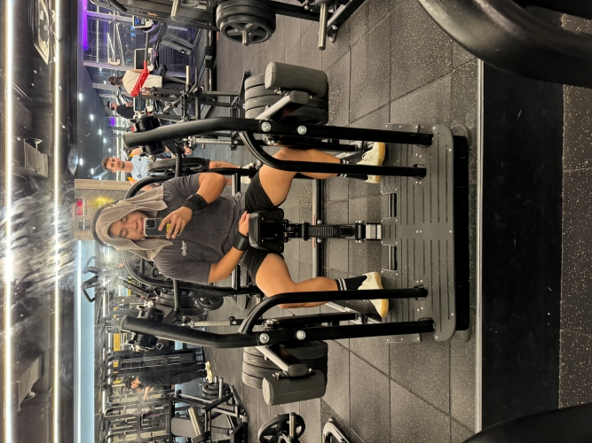
            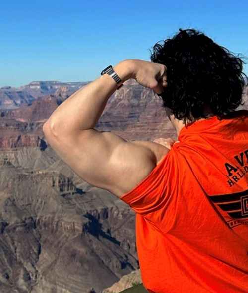
            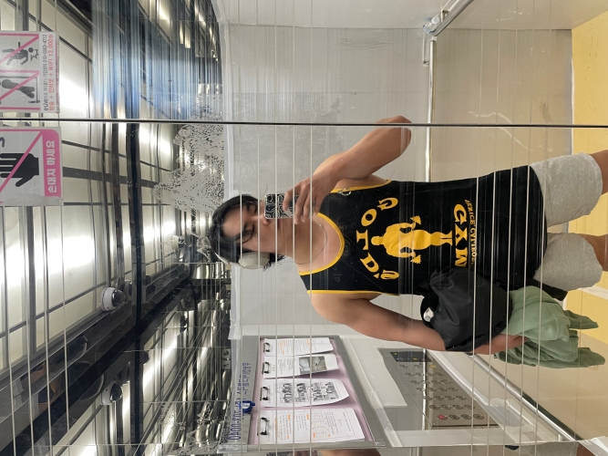
            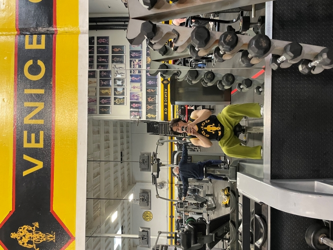
        

         
    

    
    

        
<strong>일본 애니메이션:</strong> 나는 일본 애니메이션에 깊은 감사를 느낍니다. 그 상상력이 풍부한 이야기 전개와 깊은 감정 표현은 나를 항상 매료시켜왔습니다. 어릴 적부터 나는 공상 과학 및 판타지 장르에 끌려 모험과 경이의 세계에 몰입하는 것을 즐겼습니다. 나는 스타워즈와 마블 같은 영화를 즐기지만, 소년 만화의 주인공들에게서 얻는 영감은 그와는 다릅니다. 그들의 변함없는 긍정적인 태도와 역경을 극복하려는 의지는 나와 깊은 공감을 이룹니다. 그들이 고난 속에서 승리하는 모습을 보는 것은 항상 나에게 깊은 영감을 줍니다.
<a href="javascript:void(0);" onclick="toggleExplainText(this)" class="more-btn">More</a>
        

            
            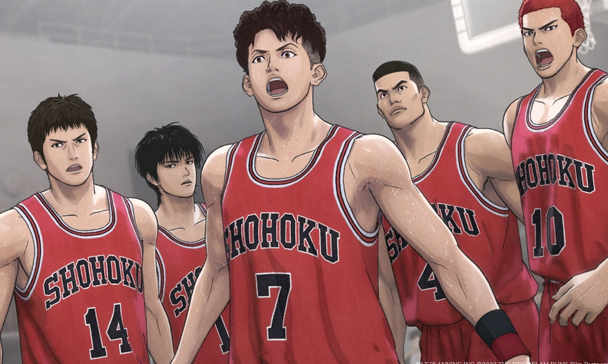
            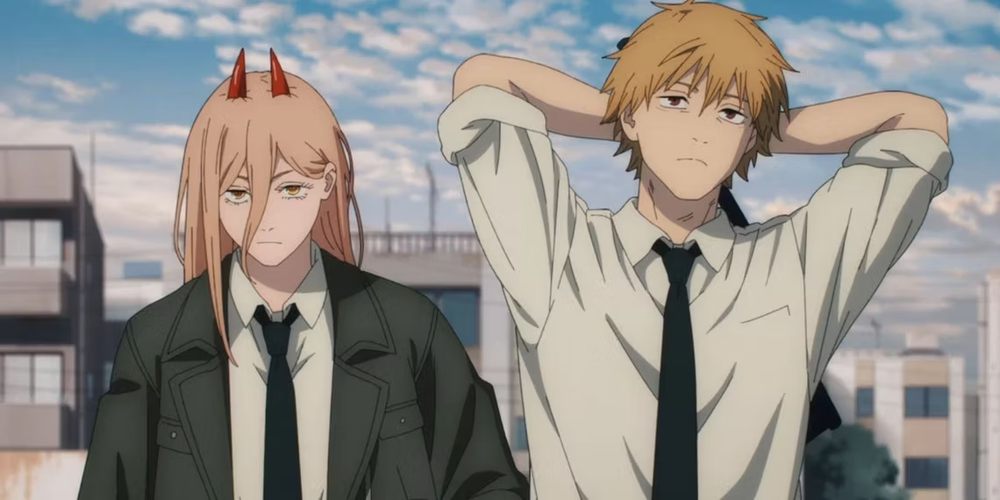
            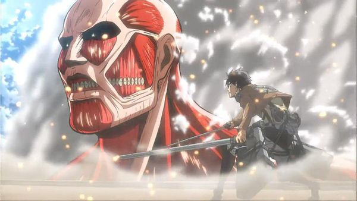
            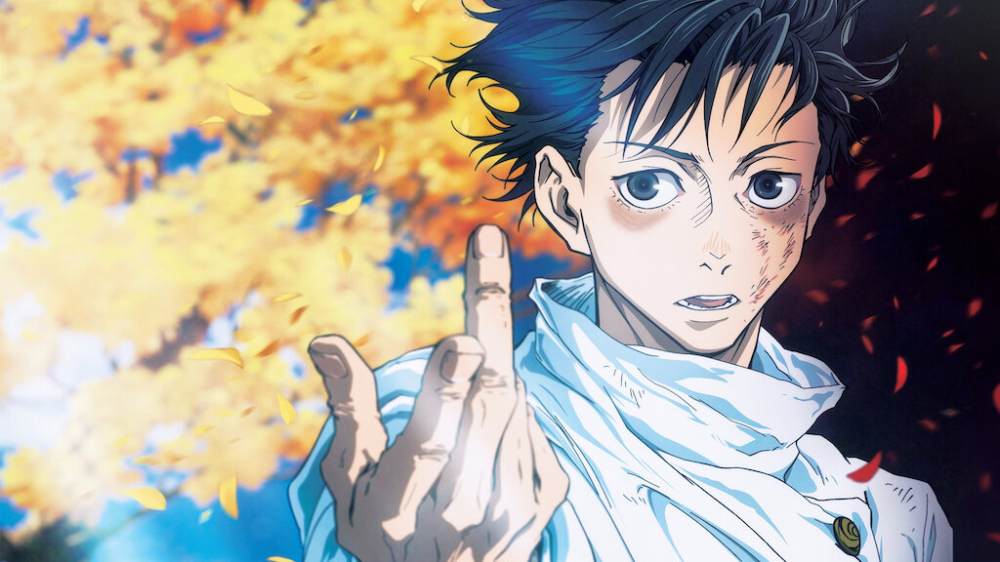
        

    

     

#### Recommended Books

    
나는 신경과학과 진화 심리학에 관한 책을 읽는 것을 깊이 사랑합니다. 우리의 뇌가 어떻게 작동하는지를 깊이 파고들고, 인간 행동의 진화적 기초를 이해하는 것은 나에게 귀중한 통찰력을 제공합니다. 삶이 불가피한 도전들을 제시할 때, 근본 원인을 이해하는 것은 내 불안을 완화시킬 뿐만 아니라 상황을 더 명확하게 접근할 수 있도록 합니다. 이러한 이해는 회복력을 기르며, 역경에 더 효과적으로 적응하고 회복할 수 있도록 합니다. 이러한 통찰을 일상 생활에 통합함으로써, 나는 지속적으로 발전하고 나 자신을 가장 좋은 모습으로 만들어 가고 있습니다.

    <a href="javascript:void(0);" onclick="toggleExplainText(this)" class="more-btn">More</a>

    

        
        Sapiens
    

    

        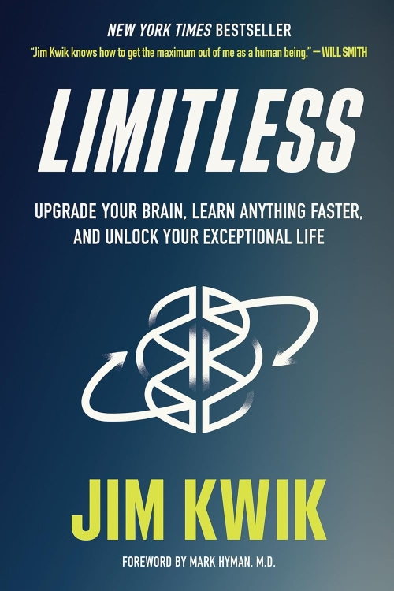
        limitless
    

    

        
        The Evolution of Desire
    

    

        
        Becoming Supernatural
    

</body>
</html>
