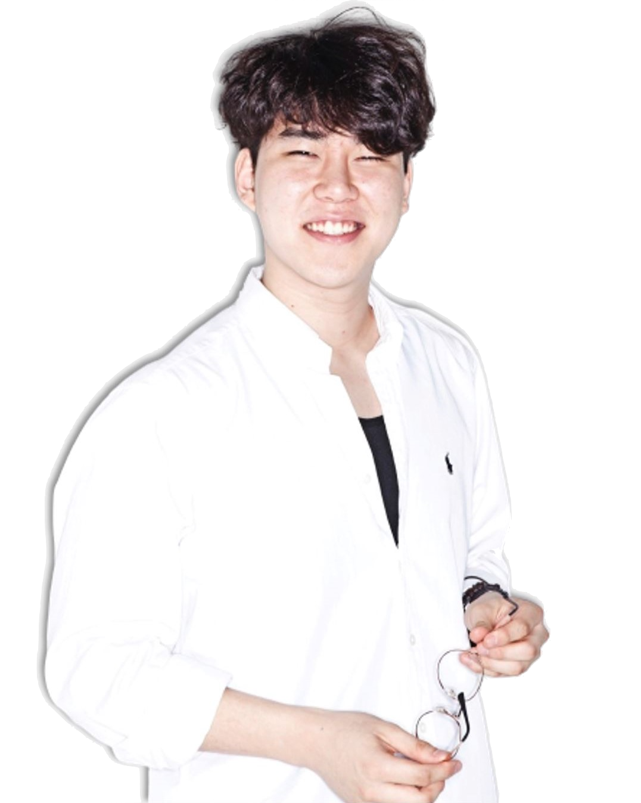

</img> 

  **임종윤**[Lim Jongyoon] 
 (he/him/his) 

**HCI researcher & Co-founder of&nbsp;**<a href="http://www.alamvr.com/" style="text-decoration:none; color:#1a73e8;">
  
  ALAM
</a>

- 저는 현재 <a href="http://creative.sogang.ac.kr" style="color:#1a73e8;">서강대학교에서</a> HCI 연구원으로 개발업무를 담당하고 있으며, 동시에  ALAM의 공동창업자 및 CTO로 일하고있습니다. 이전에 저는 <a href="http://creative.sogang.ac.kr" style="color:#1a73e8;">서강대학교 아트 앤 테크놀로지</a>에서 인간-컴퓨터 상호작용(HCI) 석사 학위를, <a href="https://eng.ssu.ac.kr" style="color:#1a73e8;">숭실대학교 공과대학</a>에서 전기공학 학사 학위를 취득했습니다. 또한 <a href="https://global.canon/en/product/indtech/semicon/" style="color:#1a73e8;">Canon 광학기기사업부</a>에서 반도체 엔지니어로 일한 경력이 있습니다.

- 관심 분야: VR/AR, 게임, 햅틱스, 멀티모달, 로보틱스

&nbsp;&nbsp;&nbsp;&nbsp;&nbsp;&nbsp;&nbsp;&nbsp;&nbsp;&nbsp;

[더 알아보기 ⬇](#publications)
